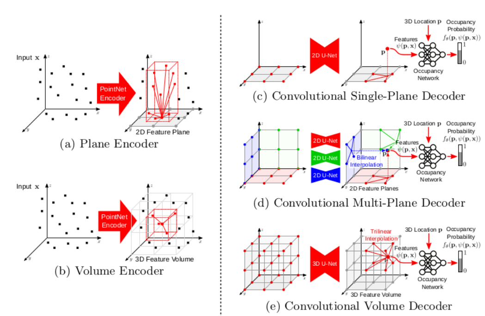

## Convolutional Occupancy Networks
You can find my seminar report and presentation about Convolutional-Occupancy-Networks publication. The work is explained in detail and the key controbutions are presented in an very intuitive way. 

 

  

##### Αcknowledgements
---
Prof. Dr. Daniel Cremers @ Computer Vision Group  
Advisor: Björn Häfner   
Department of Informatics  
Technical University of Munich (TUM)  
Computer Vision Group: https://cvg.cit.tum.de/  
